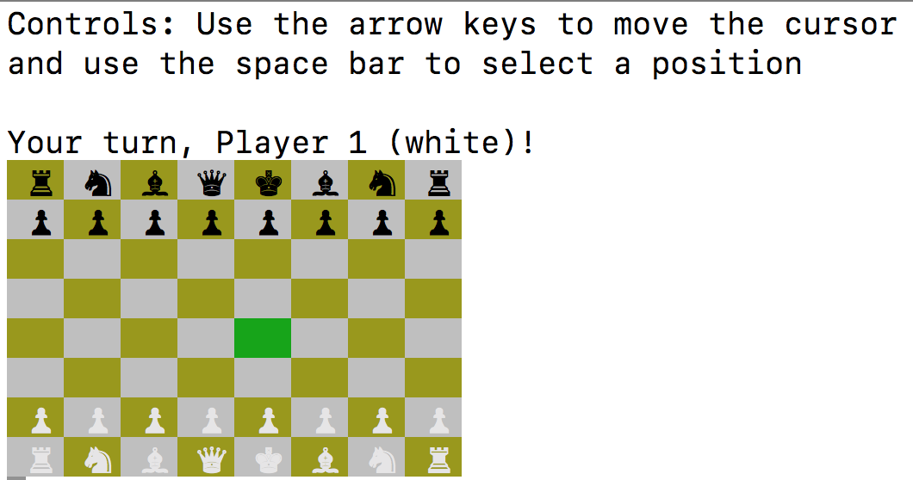

# CLI Chess
CLI Chess is a command-line chess game written in Ruby.



## Setup

1. Ensure [Ruby](https://www.ruby-lang.org/en/documentation/installation/) is installed
2. Clone this repository by running the command `$ git clone https://github.com/gtigas/CLI-Chess.git`
3. Navigate into the game folder `$ cd CLI-Chess`
4. Install dependencies `$ bundle install`
5. To start the game, run `$ ruby game.rb`

## Features/Implementation
CLI Chess is split up into four basic pieces:
1. A `Game` class which handles the overlying gameplay
2. A `Board` class which houses the board state and piece positions
3. A `Display` class that handles the rendering of the board to the command-line and handles the input of moves
4. Different piece classes that house information about each piece and how they move

### Pieces
Each piece (Pawn, Rook, Queen, etc...) is split up into its own class. To keep code DRY, shared logic and methods are housed in a parent `Piece` class which every other piece inherits from. To help with the internal logic for each piece, a reference to the `Board` is also passed in and stored as an instance variable.

### Movement
In chess, pieces can move by either sliding or stepping (with the exception of the Pawn). Sliding pieces are able to move along a straight line in a given direction. Stepping pieces can only move to a fixed number of spaces around them depending on the piece.

To replicate this behavior and to keep code reusable, I created a `SteppingPiece` Module and a `SlidingPiece` Module.

#### Stepping Pieces
Each stepping piece holds a reference to the spaces they can move, relative to [0,0]. These `move_diffs` are then given actual positions using the reference to the board, being sure to only keep moves that are on the board.

```
#stepping_piece.rb
...
def moves
  possible_moves = []
  move_diffs.each do |diff|
    move_position = Piece.get_new_position(@position, diff)
    possible_moves << move_position
  end

  possible_moves.select do |move|
    Board.in_bounds?(move) && @board[move].color != self.color
  end

end
```

#### Sliding Pieces
Each sliding piece holds a reference to which directions they are able to slide to. Using these `move_dirs`, possible moves are found by moving along that direction until they hit the end of the board or another piece.

```
#sliding_piece.rb
...
def moves
  possible_moves = []
  move_dirs.each do |diff|
    new_position = Piece.get_new_position(@position, diff)
    until !Board.in_bounds?(new_position) ||  @board[new_position].color == self.color
      possible_moves << new_position
      break unless @board[new_position].is_a?(NullPiece)
      new_position = Piece.get_new_position(new_position, diff)
    end
  end
  possible_moves
end
```
